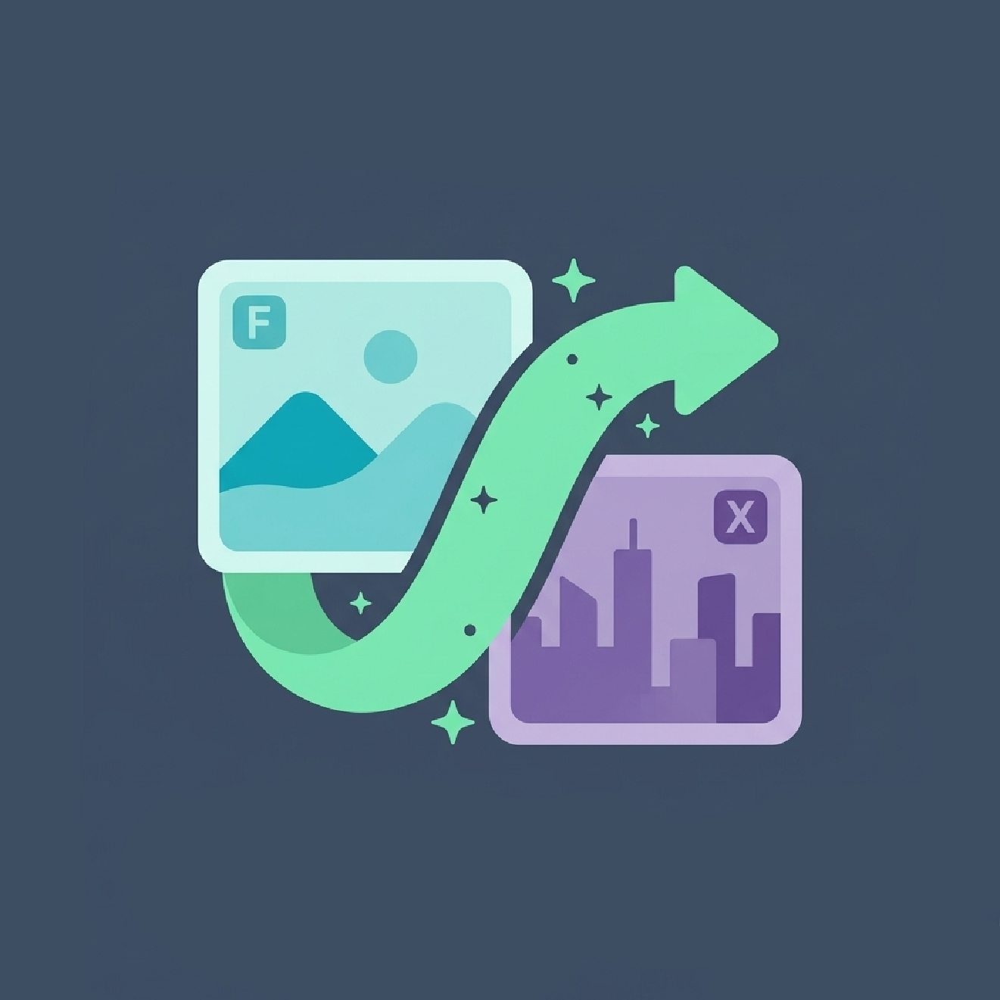

<div align="center">



# FxSlide

### ✨ Turn your images into smooth, cinematic slideshow videos ✨

*Pick your photos, choose a transition, hit record. That's it.*

<br/>

<a href="https://br1jm0h4n.github.io/FxSlide/">
  
</a>

<br/><br/>


</div>

---

## 📖 About

**FxSlide** is a lightweight, browser-based video maker that turns a set of images into a polished slideshow video with professional transitions. Everything runs **locally in your browser**: no uploads, no sign-up, no servers.

Add your images, set how long each one is shown, pick a transition and timing curve, preview it live, then record your video.

<div align="center">

### 👉 [**Launch the Live Demo**](https://br1jm0h4n.github.io/FxSlide/) 👈

</div>

---

## 🚀 Features

- 🖼️ **Multiple images**: add as many as you like, clear them in one click
- ⏱️ **Adjustable display time** for each image
- 🎞️ **20+ transition styles** across four families
- 📈 **9 timing curves** to control the feel of every transition
- ⌛ **Adjustable transition duration**
- 👀 **Live preview** before you commit
- 🔴 **One-click recording** to export your video
- 🔒 **100% private**: all processing stays on your device
- 📱 **Responsive**: works on desktop and mobile

---

## 🎬 Transitions

| Family | Styles |
|---|---|
| **Crossfade** | Classic smooth dissolve |
| **Push** | Left · Right · Up · Down |
| **Slide over** | From right · left · bottom · top |
| **Wipe** | Left→Right · Right→Left · Top→Bottom · Bottom→Top · four corner wipes · Circle reveal |
| **Special** | Zoom through · **Mix** (cycles through styles automatically) |

### 📈 Timing Curves

`Linear` · `Ease in` · `Ease out` · `Ease in-out` · `Strong ease in (cubic)` · `Strong ease out (cubic)` · `Strong ease in-out (cubic)` · `Expo in-out` · `Bounce`

---

## 🛠️ How to Use

1. **Open** the [live demo](https://br1jm0h4n.github.io/FxSlide/)
2. Click **Add images** and select your photos
3. Set the **time each image is shown**
4. Choose a **transition style**, **timing curve** and **transition duration**
5. Press **Preview** to see the result
6. Press **Record** to capture and save your video

---

## 💻 Run Locally

```bash
# Clone the repository
git clone https://github.com/BR1JM0H4N/FxSlide.git

# Enter the project folder
cd FxSlide

# Open index.html in your browser, or serve it locally:
npx serve .
```

No build step or dependencies required.

---

## 🧰 Tech Stack

- **HTML5**: structure
- **CSS3**: responsive styling
- **Vanilla JavaScript**: logic and transitions
- **Canvas API** and **MediaRecorder API**: rendering and video capture
- **GitHub Pages**: hosting

---

## 🤝 Contributing

Contributions, issues and feature requests are welcome!

1. Fork the project
2. Create your branch: `git checkout -b feature/AmazingFeature`
3. Commit your changes: `git commit -m "Add AmazingFeature"`
4. Push to the branch: `git push origin feature/AmazingFeature`
5. Open a Pull Request

Check the [issues page](https://github.com/BR1JM0H4N/FxSlide/issues) for open tasks.

---

## 📄 License

Distributed under the license found in the [LICENSE](LICENSE) file. See it for details.

---

## 👤 Author

**BR1JM0H4N**

[](https://github.com/BR1JM0H4N)

---

<div align="center">

### ⭐ If you like FxSlide, give it a star! ⭐

<a href="https://br1jm0h4n.github.io/FxSlide/">
  
</a>

Made with ❤️ by [BR1JM0H4N](https://github.com/BR1JM0H4N)

</div>
